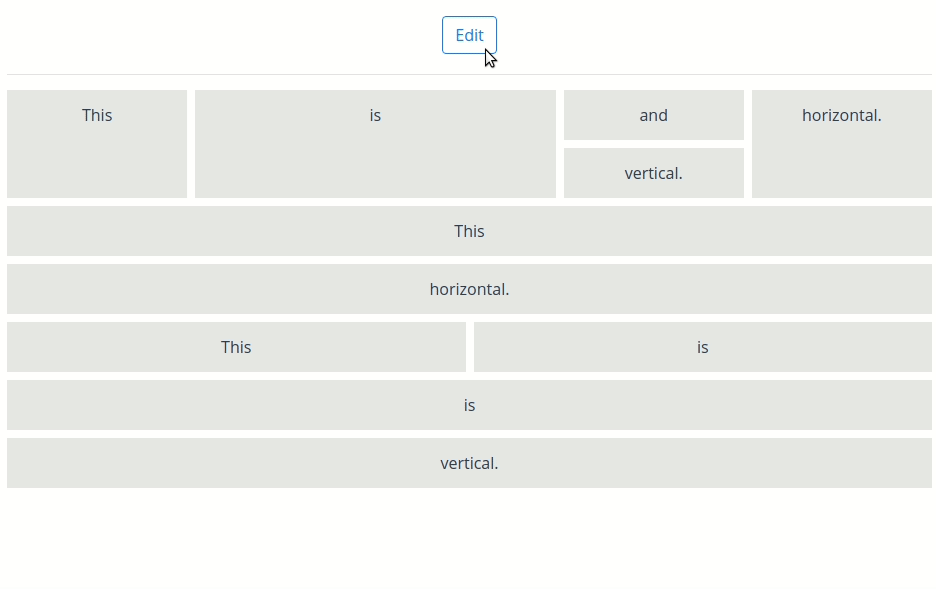

# vue-layout-composer



Dynamic, drag & drop, JSON-based grid layout for Vue. 

Create your components, specify your JSON layout configuration and let the vue-layout-composer handle the rest.

## Installation

INSTALLATION_PLACEHOLDER

## Usage

1. Add the `VueLayoutComposer` plugin in your `main.js`

```vue
Vue.use(VueLayoutComposer)
```

2. Use the `LayoutComposer` component

```vue
<template>
  <div id="app">
    <layout-composer
      :displayComponents="displayComponents"
      :config="config"
      @change:config="onConfigChange"
    />
  </div>
</template>

<script>
import config from '../config/layout.json'
import 'vue-layout-composer/dist/vue-layout-composer.css'

import Item from './components/Item'

export default {
  name: 'app',
  data() {
    return {
      displayComponents: {
        'Item': Item,
      },
    }
  },
  methods: {
    onConfigChange(newConfig) {
      console.log(newConfig)
    },
  },
}
</script>
```

## Example layout config (JSON)

```json
{
  "component": "Layout",
  "props": {
    "orientation": "vertical"
  },
  "children": [
    {
      "component": "Layout",
      "props": {
        "orientation": "horizontal"
      },
      "children": [
        {
          "component": "Item",
          "display": {
            "weight": 1
          },
          "props": {
            "background": "#E6E7E8",
            "content": "This"
          },
          "hello": "world"
        },
        {
          "component": "Item",
          "display": {
            "weight": 2
          },
          "props": {
            "background": "#E6E7E8",
            "content": "is"
          },
          "hello": "world"
        },
        {
          "component": "Layout",
          "props": {
            "orientation": "vertical"
          },
          "children": [
            {
              "component": "Item",
              "display": {
                "weight": 1
              },
              "props": {
                "background": "#E6E7E8",
                "content": "and"
              },
              "hello": "world"
            },
            {
              "component": "Item",
              "display": {
                "weight": 1
              },
              "props": {
                "background": "#E6E7E8",
                "content": "vertical."
              },
              "hello": "world"
            }
          ]
        },
        {
          "component": "Item",
          "display": {
            "weight": 1
          },
          "props": {
            "background": "#E6E7E8",
            "content": "horizontal."
          },
          "hello": "world"
        }
      ]
    },
    {
      "component": "Item",
      "props": {
        "background": "#E6E7E8",
        "content": "This"
      },
      "hello": "world"
    },
    {
      "component": "Item",
      "display": {
        "weight": 1
      },
      "props": {
        "background": "#E6E7E8",
        "content": "horizontal."
      },
      "hello": "world"
    },
    {
      "component": "Layout",
      "props": {
        "orientation": "horizontal"
      },
      "children": [
        {
          "component": "Item",
          "display": {
            "weight": 1
          },
          "props": {
            "background": "#E6E7E8",
            "content": "This"
          },
          "hello": "world"
        },
        {
          "component": "Item",
          "display": {
            "weight": 1
          },
          "props": {
            "background": "#E6E7E8",
            "content": "is"
          },
          "hello": "world"
        }
      ]
    },
    {
      "component": "Item",
      "props": {
        "background": "#E6E7E8",
        "content": "is"
      },
      "hello": "world"
    },
    {
      "component": "Item",
      "props": {
        "background": "#E6E7E8",
        "content": "vertical."
      },
      "hello": "world"
    }
  ]
}
```

## Props

### `displayComponents` (required)

Used to register your local components in the grid system context. Just specify the object with following structure:

```javascript
{
  'Item': Item,
  'OtherComponent': OtherComponent,
}
```

And you'll be able to write `"component": "Item"` and `"component": "OtherComponent"` in your layout config JSON and vue-layout-composer will understand which components you want to use.

### `config` (required)

Your layout config JSON, used to structure the grid.

### `editable`

Add if you want to be able to edit the grid (drag & drop).

## Events

### `change:config`

Triggered when the layout is locked ('Save' button is clicked).

Returns the updated layout config JSON.

You could send an API request to save the layout config data and load it whenever you want. Or save the config in local storage.

## Layout config

Layout config is a tree-based JSON structure with 2 main parts:

1. Layout nodes
2. Component nodes

There **always needs to be** one root layout node.

### Layout nodes

```json
{
  "component": "Layout",
  "props": {
    "orientation": "horizontal"
  },
  "children": [
    ...
  ]
}
```

Layout nodes are the ones that contain `"component": "Layout"`. Layout is a built-in layout component in vue-layout-composer.

Layout nodes can be `horizontal` or `vertical`, which is specified in `props.orientation` attribute. The orientation specifies the direction the layout will put the components in.

On mobile phones, layouts automatically change orientation to `vertical`.

They also contain children nodes in `children` attribute. The children nodes can be either `layout nodes` or `component nodes`.

### Component nodes

```json
{
  "component": "YOUR_COMPONENT_NAME",
  "display": {
    "weight": 1
  },
  "props": {
    "background": "#E6E7E8",
    "content": "This"
  }
}
```

Component nodes are the ones you put your own Vue components in.

Specify the component with `"component": "YOUR_COMPONENT_NAME"` and pass any props via the `props` attribute. Props are your Vue component props.

### `display` attribute

Every node supports a `display` attribute.

At the moment only `weight` is supported. It can be thought of as the `flex-grow` CSS attribute.

## Creating custom components

You can add your custom components to the layout by following a few simple API rules.

### Rules

1. Your component needs to have `lc-cell` component as the root element in template
2. Your component **needs to receive** following props:
   - `initialConfig` - json config specific for the component from the provided json config in `LayoutComposer`
   - `editable` - boolean that makes the component editable/non-editable - handle however you want
   - `cellProps` - internal cell-specific props provided by `Layout` component
3. Your component **can receive** any additional props specified in json config under `props` attribute
4. You need to pass `cellProps` to the `lc-cell` component
5. Your component needs to specify `getConfig` method that is used to build the json config after the layout is locked
   - you can inject/update any properties there, the change will be reflected in the json config
   - beware that it's one-way relationship, if you add props you need to handle them as well if you want to see the changes in DOM

### Example custom component

Here's an example of `TextBlock` component that is capable of rendering text from config, editing the text in UI & putting the changes back in config via `getConfig` method.

```vue
<template>
  <lc-cell
    v-bind="cellProps" // required internal props for the cell, better not to touch
    :key="config.id" // just a simple optimization
    :display="config.display" // display props for the cell (taken from config) - feel free to modify
    :draggable="editable && !contentEditable" // specifies if the component is draggable
    @edit:content="editContent" // on edit button clicked
    @delete:content="$emit('delete:content')" // on delete button clicked
  >
    <div class="TextBlock">
      <p
        :contenteditable="contentEditable"
        @keydown.enter="updateText"
        @focusout="updateText"
        :draggable="contentEditable"
        @dragstart.prevent.stop
        @drag.prevent.stop
        ref="text"
      >
        {{ internalText }}
      </p>
    </div>
  </lc-cell>
</template>

<script>
export default {
  name: 'TextBlock',
  props: {
    // vue-layout-composer props
    initialConfig:      Object,   // required, internal props
    editable:           Boolean,  // required, internal props
    cellProps:          Object,   // required, internal props

    // custom props
    text:               String,   // custom props specified in json config
  },
  data() {
    return {
      internalText:     this.text,
      config:           {},
      contentEditable:  false,
    }
  },
  created() {
    this.config = {
      ...this.initialConfig,
    }
  },
  watch: {
    internalText() {
      this.config.props.text = this.internalText
    },
  },
  methods: {
    // object returned by `getConfig` ends up in the final json config after locking the editor
    getConfig() {
      return this.config
    },
    editContent() {
      this.contentEditable = true
      setTimeout(() => this.$refs.text.focus(), 0)
    },
    updateText(event) {
      this.internalText = event.target.textContent.trim()
      this.contentEditable = false
    }
  }
}
</script>

<style scoped>
// ...
</style>
```

## Goals

- [ ] Layout properties view
- [ ] Resize in editor
- [ ] Registered components picker
- [ ] Server-side rendering support

## Long-term Goals

- [ ] Data down, actions up
- [ ] Power layout - support for GraphQL
